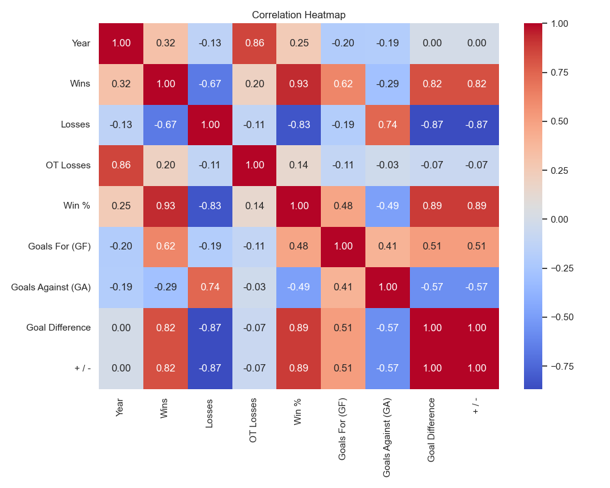
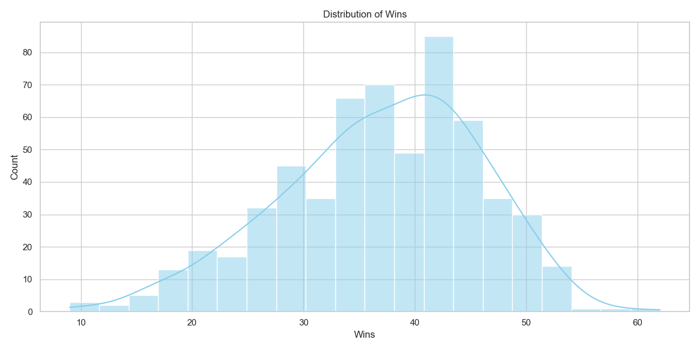
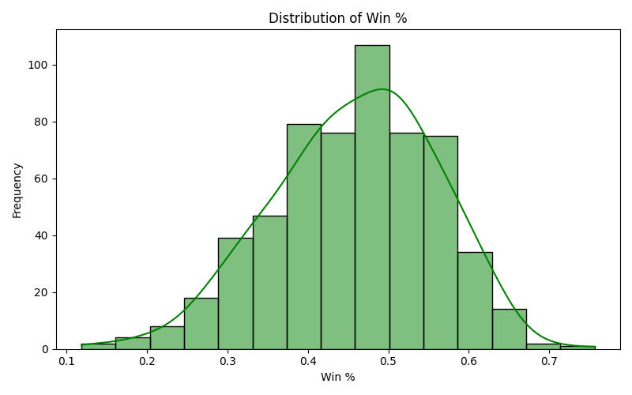
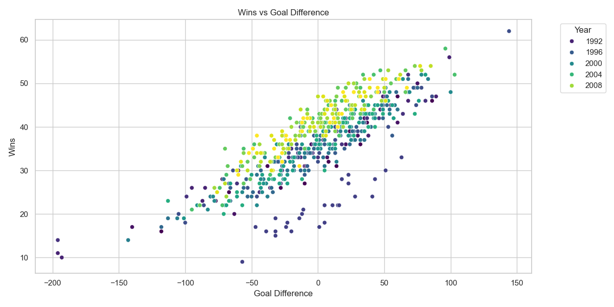
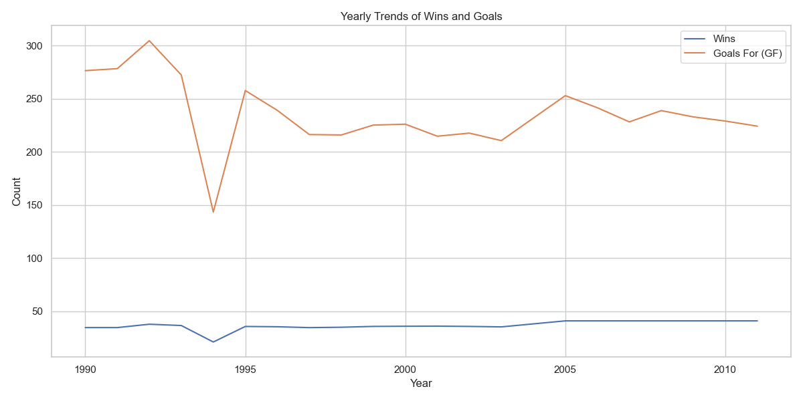
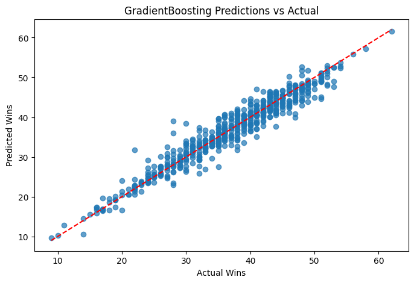
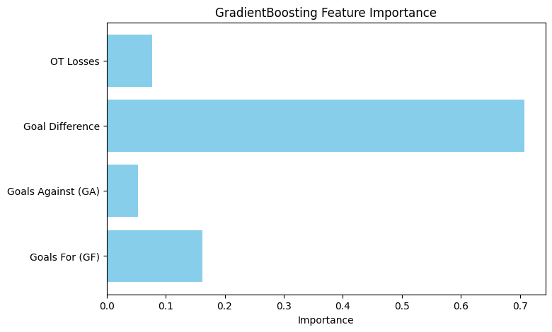

# 🏒 NHL Data Analytics Pipeline

An end-to-end **Data Analytics & Machine Learning Pipeline** for analyzing NHL team performance and predicting wins using historical statistics.

---

## 📌 Project Overview

This project demonstrates a complete real-world data workflow starting from raw data collection to machine learning model deployment.

The pipeline includes:

* Data Collection & Scraping
* Data Cleaning & Preprocessing
* Exploratory Data Analysis (EDA)
* Machine Learning Modeling
* Model Evaluation
* Visualization & Reporting

---

## 🧱 Project Structure

```
NHL-DATA-ANALYTICS-PIPELINE/
├── data/
│   ├── final/
│   ├── processed/
│   └── raw/
├── docs/
├── models/
├── notebooks/
├── reports/
│   ├── figures/
│   └── powerbi/
├── src/
│   ├── analysis/
│   ├── modeling/
│   ├── preprocessing/
│   └── scraping/
├── venv/
├── README.md
└── requirements.txt
```

---

## ⚙️ Technologies Used

* Python
* Pandas
* NumPy
* Matplotlib
* Scikit-learn
* Joblib
* Jupyter Notebook
* Power BI

---

## 🔄 Data Pipeline Workflow

### 1️⃣ Data Scraping

**File:** `src/scraping/scraper.py`

Collects NHL statistics data.

---

### 2️⃣ Data Cleaning & Preprocessing

**File:** `src/preprocessing/clean_data.py`

Tasks performed:

* Data validation
* Cleaning inconsistencies
* Feature preparation
* Export clean dataset

Output:

```
data/processed/nhl_data_clean.csv
```

---

### 3️⃣ Exploratory Data Analysis (EDA)

Notebook:

```
notebooks/01_EDA.ipynb
```

---

## 📊 Visual Analysis

### Correlation Heatmap



### Wins Distribution



### Win Percentage Distribution



### Wins vs Goal Difference



### Yearly Performance Trends



---

## 🤖 Machine Learning Modeling

Training Script:

```
src/modeling/train_model.py
```

Evaluation Script:

```
src/modeling/evaluate_model.py
```

---

## 🧠 Models Trained

| Model             | Purpose                  |
| ----------------- | ------------------------ |
| Linear Regression | Baseline comparison      |
| Random Forest     | Non-linear relationships |
| Gradient Boosting | Final optimized model    |

---

## 📈 Model Evaluation Results

Metrics Used:

* MAE (Mean Absolute Error)
* RMSE (Root Mean Squared Error)
* R² Score

### Prediction vs Actual



### Feature Importance


### Feature Importance (Evaluation)



---

## 🏆 Best Model Selection

**Gradient Boosting** was selected because:

* Lowest prediction error
* Highest R² score
* Strong handling of nonlinear relationships
* Better generalization on unseen data

Saved Model:

```
models/GradientBoosting_nhl_model.pkl
```

Load model example:

```python
import joblib
model = joblib.load("models/GradientBoosting_nhl_model.pkl")
```

---

## 🚀 How to Run the Project

### Install dependencies

```
pip install -r requirements.txt
```

### Train model

```
python src/modeling/train_model.py
```

### Evaluate model

```
python src/modeling/evaluate_model.py
```

---

## 📊 Power BI Dashboard

Power BI files are stored inside:

```
reports/powerbi/
```

Used for interactive analytics and business insights visualization.

---

## 📝 Documentation

Project notes and analysis explanation:

```
docs/project_notes.md
```

---

## 🔮 Future Improvements

* Hyperparameter tuning
* Cross-validation pipeline
* Automated ML workflow
* Deployment API
* Real-time dashboard integration

---

## 👨‍💻 Author

**Youssef Mohamed Elsayed**
Data Analyst | Machine Learning Enthusiast
