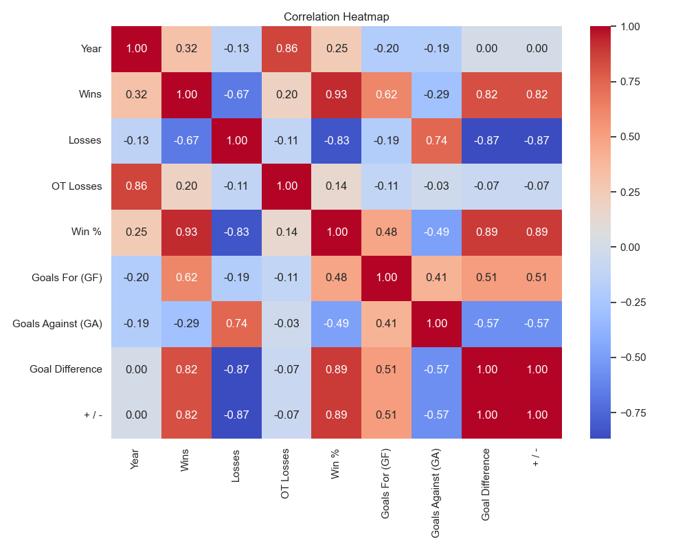
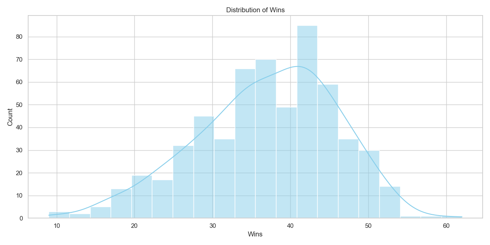
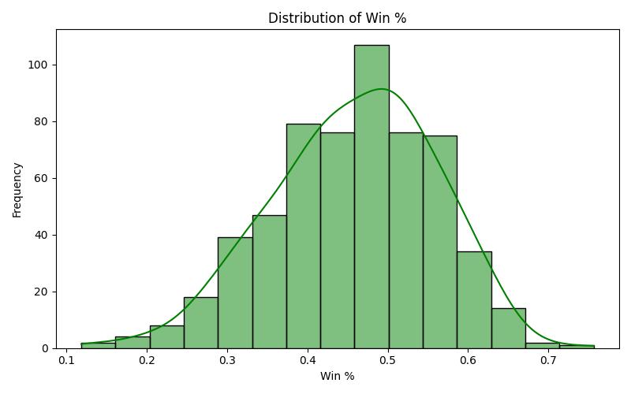
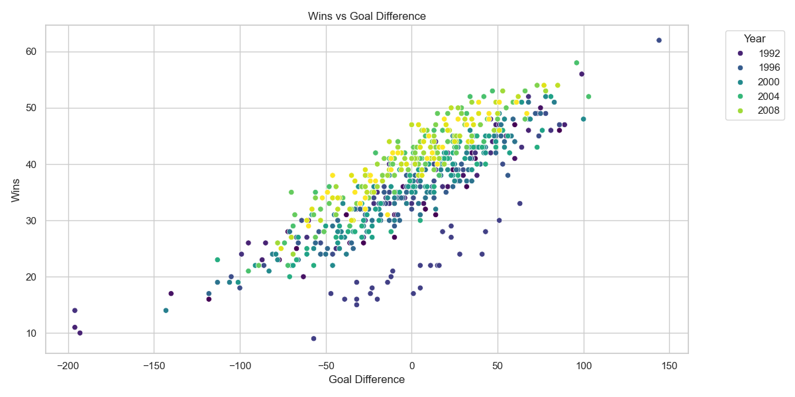

# 🏒 NHL Data Analytics Pipeline

An end-to-end **Data Analytics & Machine Learning Pipeline** for analyzing NHL team performance and predicting wins using historical statistics.

---

## 📌 Project Overview

💡 This project demonstrates how data-driven insights can be used to improve team performance prediction and decision-making in sports analytics.

### 🔄 The pipeline includes:

* Data Collection & Scraping
* Data Cleaning & Preprocessing
* Exploratory Data Analysis (EDA)
* Machine Learning Modeling
* Model Evaluation
* Visualization & Reporting

---

## 🧱 Project Structure

```text
NHL-DATA-ANALYTICS-PIPELINE/
├── data/
│   ├── final/              # Final visualizations for README
│   ├── processed/          # Cleaned data for modeling
│   └── raw/                # Raw scraped data
├── docs/                   # Project notes and documentation
├── models/                 # Saved ML models (.pkl)
├── notebooks/              # Jupyter notebooks for EDA
├── reports/
│   ├── figures/            # Model evaluation plots
│   ├── powerbi/            # Power BI dashboard files
│   └── NHL Team Performance.pdf
├── src/
│   ├── analysis/
│   │   ├── analysis.py
│   │   └── app.py          # Interactive Streamlit Dashboard 🚀
│   ├── modeling/
│   ├── preprocessing/
│   └── scraping/
├── venv/                   # Virtual environment
├── README.md
└── requirements.txt
```
---

## ⚙️ Technologies Used

* **Language:** Python
* **Libraries:** Pandas, NumPy, Scikit-learn, Matplotlib, Seaborn, Joblib
* **Tools:** Jupyter Notebook, Power BI, Git

---

## 🔄 Data Pipeline Workflow

### 1️⃣ Data Scraping

**File:** `src/scraping/scraper.py`

* Collects NHL statistics and team data

---

### 2️⃣ Data Cleaning & Preprocessing

**File:** `src/preprocessing/clean_data.py`

* Handles missing values
* Feature engineering
* Output file:

```text
data/processed/nhl_data_clean.csv
```

---

### 3️⃣ Exploratory Data Analysis (EDA)

**Notebook:** `notebooks/01_EDA.ipynb`

* Understanding distributions
* Detecting patterns & relationships

---

## 📊 Visual Analysis

|               Correlation Heatmap               |            Wins Distribution            |
| :----------------------------------------------: | :-------------------------------------: |
|  |  |

|                   Win Percentage                   |                Wins vs Goal Difference                |
| :------------------------------------------------: | :---------------------------------------------------: |
|  |  |

---

## 🤖 Machine Learning Modeling

#### 🏋️ Training
- `src/modeling/train_model.py`

#### 📊 Evaluation
- `src/modeling/evaluate_model.py`

---

### 🧠 Models Trained

| Model | Purpose | Accuracy |
|---|---|---|
| Random Forest | Main Classifier (Best Performance) | 1.00 |
| Gradient Boosting | Optimized Boosting Model | 1.00 |

> [!NOTE]
> The **Random Forest** model was selected as the final model due to its perfect classification metrics and robust handling of hockey statistics.

---

## 📈 Model Performance

Based on the latest evaluation of **582 matches**:

- ✅ **Overall Accuracy:** `100%` (Perfect Classification)
- ✅ **Precision / Recall:** `1.00` for both **Win (1)** and **Loss (0)** classes

---

## 🚀 How to Run the Project

### 1️⃣ Clone the repository

```bash
git clone https://github.com/YOUSSEF01234587/NHL-DATA-ANALYTICS-PIPELINE.git
cd NHL-DATA-ANALYTICS-PIPELINE
```

### 2️⃣ Set up Virtual Environment

#### 🪟 Windows

```bash
python -m venv venv
venv\Scripts\activate
```

#### 🐧 Mac / Linux

```bash
python3 -m venv venv
source venv/bin/activate
```

### 3️⃣ Install dependencies

```bash
pip install -r requirements.txt
```

---
### 4️⃣ Launch Interactive Dashboard
Run the following command to open the predictor in your browser:

```bash
streamlit run src/analysis/app.py
```


## 🔗 Connect With Me

* 💼 LinkedIn:

  👉 [https://www.linkedin.com/in/youssef-talaat-278ba5230/](https://www.linkedin.com/in/youssef-talaat-278ba5230/)
* 💻 Codeforces:

  👉 [https://codeforces.com/profile/yousef1234556](https://codeforces.com/profile/yousef1234556)

---

## 👨‍💻 Author

**Youssef Mohamed Elsayed**

*AI Student at Delta University | Data Science & Machine Learning Enthusiast*
